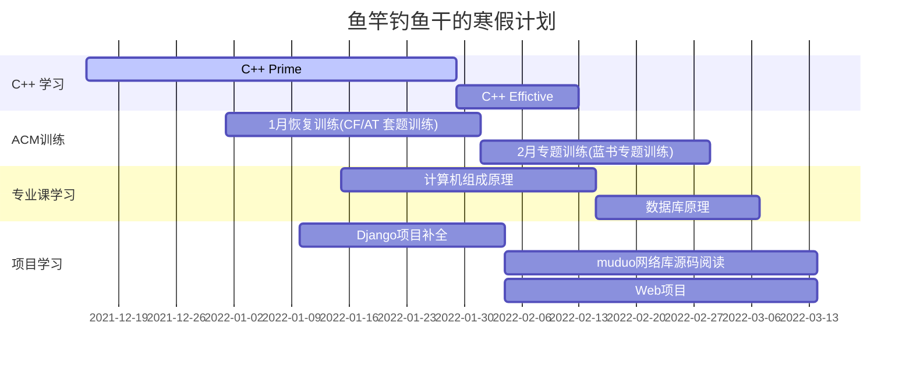

<h1 align="center">📔 Oh my Fish</h1>

鱼竿钓鱼干的学习笔记，包含如下内容<strong>C++基础知识，计算机组成原理，计算机操作系统，计算机网络，设计模式，数据库，数据结构与算法，个人项目准备等内容</strong>

    
 

 

## 🧒关于我

就读于 NEFU 2020级 软件工程  的一名普通本科生

日常摸鱼，只学一些自己感兴趣的玩意

技能点：

C/C++：只会拿来刷刷题

Python：调包侠

Linux：使用archlinux系统作为日常工作系统，掌握一定的Linux系统编程知识，习惯终端命令行

HTML,  CSS, markdown：主要用于日常编写文档

git, vim, makefile：只会基础操作

~~掌握基础数据结构与算法设计能力~~（会使用暴力算法瞎搞）

Email：851892190@qq.com

## 📝做什么

* 记录C++服务器技术方向的学习笔记
* 收集相关岗位面试资料
* 为本校同学整理专业课考试复习资料，减轻阶段考压力

## ❓为什么做这个

* 学校软件工程培养方案主要培养Java后端和Web前端方向人才，C++服务器开发方向缺少路线指引，就业难度大
* 找份好工作，为家庭提供幸福生活的物质保障
* 结交一些相关专业的朋友，扩大个人影响力
* 锻炼专业技能的同时积累各方面资源

## 注意事项

如无特殊说明，我将使用如下配置进行一些代码的编写和运行

OS: ArchLinux  x86_64

Kernel: 5.15.7-arch1-1

CPU: Intel i5-1035G1 (8) @ 3.600GHz

GPU: Intel Iris Plus Graphics G1

GPU: NVIDIA GeForce MX350

Memory: 8G

IDE/编辑器：Clion、Vscode、vim

g++ (GCC) 11.1.0

## 我的进度

## 📒内容

* [C++](C++/README.md)

  * [C++ Prime 学习笔记](C++/C++prime/README.md) 更新中
  * [Effictive C++ 学习笔记](C++/EffictiveC++/README.md)更新中
* [专业课]()
	* [数据结构 严蔚敏 课本知识点整理](专业课/数据结构%20严蔚敏/README.md)
	* [计算机组成原理  唐朔飞 课本知识点整理](/专业课/计算机组成原理%20唐朔飞/README.md) 更新中
	* [操作系统 课本知识点整理]()
	* [数据库原理 课本知识点整理]()
	* [计算机网络 课本知识点整理]()

* [课堂之外]()
  * [操作系统实战45讲](课堂之外/操作系统实战45讲)
  * [Linux](课堂之外/Linux)
  * [设计模式]()
  * [MySql]()
  * [Django]()
* [各类题解]()
  * [力扣热题100]()
  * [剑指OFFER]()
  * [Atcoder题解 竞赛向](/各类题解/atcoder.md) 更新中
  * [Codeforces题解 竞赛向](/各类题解/codeforces.md) 更新中
  * [力扣周赛题解](/各类题解/力扣周赛题解.md) 更新中
* [个人项目准备]()
  * [muduo网络库 学习笔记]()
  * [个人HTTP服务器项目]()
* [个人杂谈]()
* [资源汇总(八股文、公司内推、书籍课程)]()

## ❤️致拜访者

* 感谢你的来访，希望这些资料对你有帮助，如有建议可以直接在网站下方评论或通过QQ联系我
* 请不要用匿名或者小号的形式与我交流
* 我是个普通人，不必觉得我很难接触。你找我我看到了基本都会回复，但是一般情况下我很少会主动去和你交流。
* 真正重要的东西在课堂之外，在考试之后
* 我没有很卷，大部分时候我在做自己想做的事情，拿自己想拿的东西
* 如果需要打印网页的pdf资料，请QQ联系我

