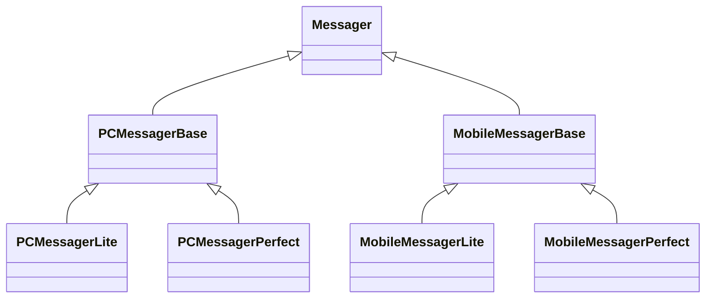
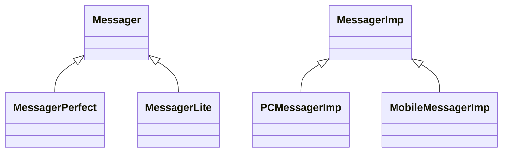

# Bridge 模式

## 动机

- 由于某些类型的固有的实现逻辑，使得它们具有两个变化的维度，乃至多个纬度的变化。
- 如何应对这种“多维度的变化”？如何利用面向对象技术来使得类型可以轻松地沿着两个乃至多个方向变化，而不引入额外的复杂度？


## 模式定义

将抽象部分(业务功能)与实现部分(平台实现)分离，使它们都可以独立地变化。 ——《设计模式》GoF


## SHOW ME THE CODE

### 初始代码

`bridge1.cpp`

```cpp
class Messager{
public:
    virtual void Login(string username, string password)=0;
    virtual void SendMessage(string message)=0;
    virtual void SendPicture(Image image)=0;

    virtual void PlaySound()=0;
    virtual void DrawShape()=0;
    virtual void WriteText()=0;
    virtual void Connect()=0;
    
    virtual ~Messager(){}
};


//平台实现

class PCMessagerBase : public Messager{
public:
    
    virtual void PlaySound(){
        //**********
    }
    virtual void DrawShape(){
        //**********
    }
    virtual void WriteText(){
        //**********
    }
    virtual void Connect(){
        //**********
    }
};

class MobileMessagerBase : public Messager{
public:
    
    virtual void PlaySound(){
        //==========
    }
    virtual void DrawShape(){
        //==========
    }
    virtual void WriteText(){
        //==========
    }
    virtual void Connect(){
        //==========
    }
};


//业务抽象

class PCMessagerLite : public PCMessagerBase {
public:
    
    virtual void Login(string username, string password){
        
        PCMessagerBase::Connect();
        //........
    }
    virtual void SendMessage(string message){
        
        PCMessagerBase::WriteText();
        //........
    }
    virtual void SendPicture(Image image){
        
        PCMessagerBase::DrawShape();
        //........
    }
};


class PCMessagerPerfect : public PCMessagerBase {
public:
    
    virtual void Login(string username, string password){
        
        PCMessagerBase::PlaySound();
        //********
        PCMessagerBase::Connect();
        //........
    }
    virtual void SendMessage(string message){
        
        PCMessagerBase::PlaySound();
        //********
        PCMessagerBase::WriteText();
        //........
    }
    virtual void SendPicture(Image image){
        
        PCMessagerBase::PlaySound();
        //********
        PCMessagerBase::DrawShape();
        //........
    }
};


class MobileMessagerLite : public MobileMessagerBase {
public:
    
    virtual void Login(string username, string password){
        
        MobileMessagerBase::Connect();
        //........
    }
    virtual void SendMessage(string message){
        
        MobileMessagerBase::WriteText();
        //........
    }
    virtual void SendPicture(Image image){
        
        MobileMessagerBase::DrawShape();
        //........
    }
};


class MobileMessagerPerfect : public MobileMessagerBase {
public:
    
    virtual void Login(string username, string password){
        
        MobileMessagerBase::PlaySound();
        //********
        MobileMessagerBase::Connect();
        //........
    }
    virtual void SendMessage(string message){
        
        MobileMessagerBase::PlaySound();
        //********
        MobileMessagerBase::WriteText();
        //........
    }
    virtual void SendPicture(Image image){
        
        MobileMessagerBase::PlaySound();
        //********
        MobileMessagerBase::DrawShape();
        //........
    }
};


void Process(){
        //编译时装配
        Messager *m =
            new MobileMessagerPerfect();
}


```



似曾相识的感觉，我们来看看扩展规模。如果有$n$个平台，每个平台有$m$个版本。那么类的数目$1+n+m*n$

代码也有冗余，例如

```cpp
virtual void Login(string username, string password){

    PCMessagerBase::PlaySound();
    //********
    PCMessagerBase::Connect();
    //........
}

virtual void Login(string username, string password){

    MobileMessagerBase::PlaySound();
    //********
    MobileMessagerBase::Connect();
    //........
}
```

### 优化1：继承转组合

类似`Decorator`设计模式，我们可以想到用指针实现继承转组合的优化

对`PCMessagerLite`做如下修改(具体每一步可以看`Decorator`设计模式里的步骤)

```cpp
//class PCMessagerLite : public PCMessagerBase {
class PCMessagerLite{
    Message* messager;//=new PCMessagerBase();
public:
    
    virtual void Login(string username, string password){
        
        //PCMessagerBase::Connect();
        messager->Connect();
        //........
    }
    virtual void SendMessage(string message){
        
        //PCMessagerBase::WriteText();
        messager->WriteText();
        //........
    }
    virtual void SendPicture(Image image){
        
        //PCMessagerBase::DrawShape();
        messager->DrawShape();
        //........
    }
};
```

现在发现`PCMessagerLite`和`MoblieMessagerLite`可以合并了

### 优化2：拆分抽象基类

还有个问题，`PCMessagerBase`是一个抽象类（纯虚基类），但是我们没有把所有虚的函数覆盖

```cpp
Message* messager;//=new PCMessagerBase();这个实际上不成立
```

那么可发现`Messager`里的几个纯虚函数不应该都放在一起，应该拆分开来

```cpp
class Messager{
public:
    virtual void Login(string username, string password)=0;
    virtual void SendMessage(string message)=0;
    virtual void SendPicture(Image image)=0;

    virtual void PlaySound()=0;
    virtual void DrawShape()=0;
    virtual void WriteText()=0;
    virtual void Connect()=0;
    
    virtual ~Messager(){}
};

```

增加一个`MessagerImp`

```cpp
class Messager{
protected:
     MessagerImp* messagerImp;//...
public:
    virtual void Login(string username, string password)=0;
    virtual void SendMessage(string message)=0;
    virtual void SendPicture(Image image)=0;
    
    virtual ~Messager(){}
};

// 不同的变化方向(业务和平台)，所以分为两个类
class MessagerImp{
public:
    virtual void PlaySound()=0;
    virtual void DrawShape()=0;
    virtual void WriteText()=0;
    virtual void Connect()=0;
    
    virtual MessagerImp(){}
};
```

和`Decorator`设计模式一样进行一个字段的提升，然后添加构造器

`bridge2.cpp`

```cpp
class Messager{
protected:
     MessagerImp* messagerImp;//...字段提到父类了
public:
    virtual void Login(string username, string password)=0;
    virtual void SendMessage(string message)=0;
    virtual void SendPicture(Image image)=0;
    
    virtual ~Messager(){}
};

// 不同的变化方向(业务和平台)，所以分为两个类
class MessagerImp{
public:
    virtual void PlaySound()=0;
    virtual void DrawShape()=0;
    virtual void WriteText()=0;
    virtual void Connect()=0;
    
    virtual MessagerImp(){}
};


//平台实现 n
class PCMessagerImp : public MessagerImp{
public:
    
    virtual void PlaySound(){
        //**********
    }
    virtual void DrawShape(){
        //**********
    }
    virtual void WriteText(){
        //**********
    }
    virtual void Connect(){
        //**********
    }
};

class MobileMessagerImp : public MessagerImp{
public:
    
    virtual void PlaySound(){
        //==========
    }
    virtual void DrawShape(){
        //==========
    }
    virtual void WriteText(){
        //==========
    }
    virtual void Connect(){
        //==========
    }
};


//业务抽象 m

//类的数目：1+n+m

class MessagerLite :public Messager {

    
public:
    
    virtual void Login(string username, string password){
        
        messagerImp->Connect();
        //........
    }
    virtual void SendMessage(string message){
        
        messagerImp->WriteText();
        //........
    }
    virtual void SendPicture(Image image){
        
        messagerImp->DrawShape();
        //........
    }
};


class MessagerPerfect  :public Messager {
    
   
public:
    
    virtual void Login(string username, string password){
        
        messagerImp->PlaySound();
        //********
        messagerImp->Connect();
        //........
    }
    virtual void SendMessage(string message){
        
        messagerImp->PlaySound();
        //********
        messagerImp->WriteText();
        //........
    }
    virtual void SendPicture(Image image){
        
        messagerImp->PlaySound();
        //********
        messagerImp->DrawShape();
        //........
    }
};


void Process(){
    //运行时装配
    MessagerImp* mImp=new PCMessagerImp();
    Messager *m =new Messager(mImp);
}


```

现在规模变为$1+n+m$了，问题得到了有效解决



平台实现和业务抽象的变化方向是不一样的，应该将他们分离，使他们可以独立的变化

## 结构设计

红色稳定，蓝色变化


## 要点总结

- Bridge模式使用“对象间的组合关系”解耦了抽象和实现之间固有的绑定关系，使得抽象和实现可以沿着各自的维度来变化。所谓抽象和实现沿着各自纬度的变化，即“子类化”它们。
- Bridge模式有时候类似于多继承方案，但是多继承方案往往违背单一职责原则（即一个类只有一个变化的原因），复用性比较差。Bridge模式是比多继承方案更好的解决方法。
- Bridge模式的应用一般在“两个非常强的变化维度”，有时一个类也有多于两个的变化维度，这时可以使用Bridge的扩展模式。