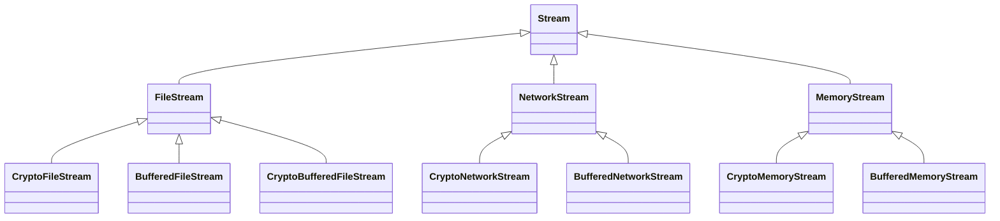
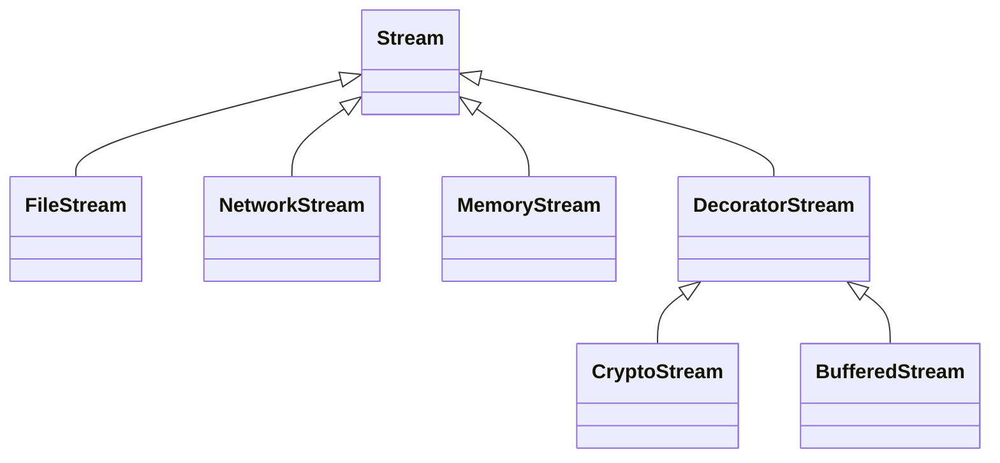

# Decorator 模式

## 动机

**过度使用继承来扩展对象的功能**，由于继承为类型引入的静态特质，使得这种扩张方式缺乏灵活性；并且随着子类的增多（扩展功能的增多），各种子类的组合（扩展功能的组合）会**导致更多子类的膨胀**


* 如何使对象功能的扩展能够根据需要动态的实现？
* 同时避免扩展功能的增多带来的子类膨胀问题？
* 从而使得任何功能扩展变化导致的影响降至最低？


## 模式定义

动态（组合手段）地给一个对象增加一些额外的职责。就增加功能而言，Decorator模式比生成子类（继承）更为灵活（消除重复代码 & 减少子类个数）。 ——《设计模式》GoF


## SHOW ME THE CODE

### 初始代码

`decorator1.cpp`

```cpp
//业务操作
class Stream{
public:
    virtual char Read(int number)=0;
    virtual void Seek(int position)=0;
    virtual void Write(char data)=0;
    
    virtual ~Stream(){}
};

//主体类
class FileStream: public Stream{
public:
    virtual char Read(int number){
        //读文件流
    }
    virtual void Seek(int position){
        //定位文件流
    }
    virtual void Write(char data){
        //写文件流
    }

};

class NetworkStream :public Stream{
public:
    virtual char Read(int number){
        //读网络流
    }
    virtual void Seek(int position){
        //定位网络流
    }
    virtual void Write(char data){
        //写网络流
    }
    
};

class MemoryStream :public Stream{
public:
    virtual char Read(int number){
        //读内存流
    }
    virtual void Seek(int position){
        //定位内存流
    }
    virtual void Write(char data){
        //写内存流
    }
    
};

//扩展操作
class CryptoFileStream :public FileStream{
public:
    virtual char Read(int number){
       
        //额外的加密操作...
        FileStream::Read(number);//读文件流
        
    }
    virtual void Seek(int position){
        //额外的加密操作...
        FileStream::Seek(position);//定位文件流
        //额外的加密操作...
    }
    virtual void Write(byte data){
        //额外的加密操作...
        FileStream::Write(data);//写文件流
        //额外的加密操作...
    }
};

class CryptoNetworkStream : public NetworkStream{
public:
    virtual char Read(int number){
        
        //额外的加密操作...
        NetworkStream::Read(number);//读网络流
    }
    virtual void Seek(int position){
        //额外的加密操作...
        NetworkStream::Seek(position);//定位网络流
        //额外的加密操作...
    }
    virtual void Write(byte data){
        //额外的加密操作...
        NetworkStream::Write(data);//写网络流
        //额外的加密操作...
    }
};

class CryptoMemoryStream : public MemoryStream{
public:
    virtual char Read(int number){
        
        //额外的加密操作...
        MemoryStream::Read(number);//读内存流
    }
    virtual void Seek(int position){
        //额外的加密操作...
        MemoryStream::Seek(position);//定位内存流
        //额外的加密操作...
    }
    virtual void Write(byte data){
        //额外的加密操作...
        MemoryStream::Write(data);//写内存流
        //额外的加密操作...
    }
};

class BufferedFileStream : public FileStream{
    //...
};

class BufferedNetworkStream : public NetworkStream{
    //...
};

class BufferedMemoryStream : public MemoryStream{
    //...
};


class CryptoBufferedFileStream :public FileStream{
public:
    virtual char Read(int number){
        
        //额外的加密操作...
        //额外的缓冲操作...
        FileStream::Read(number);//读文件流
    }
    virtual void Seek(int position){
        //额外的加密操作...
        //额外的缓冲操作...
        FileStream::Seek(position);//定位文件流
        //额外的加密操作...
        //额外的缓冲操作...
    }
    virtual void Write(byte data){
        //额外的加密操作...
        //额外的缓冲操作...
        FileStream::Write(data);//写文件流
        //额外的加密操作...
        //额外的缓冲操作...
    }
};


void Process(){

        //编译时装配
    CryptoFileStream *fs1 = new CryptoFileStream();

    BufferedFileStream *fs2 = new BufferedFileStream();

    CryptoBufferedFileStream *fs3 =new CryptoBufferedFileStream();

}
```



如果类还是同等规模的扩展，假设有$n$个不同类型的$Stream$，每个有$m$种操作，将会造成$1+n+m*n$级别的扩张?实际上还包括组合的情况，扩张会达到$1+n+n*m！*\frac 12$级别

在类数量扩张的同时还会出现代码冗余的情况（典型的BadSmell），例如第`59`、`79`、`98`行都是对`READ`的一个加密操作，实际上操作是相同的，不会因为`READ`的不同而不一样，`Seek`和`Write`同理。但其中也有一点点的不同之处，例如第`60`、`80`、`99`行。


### 优化1：继承改组合

考虑一下设计原则：优先使用对象组合，而不是类继承

* 类继承通常为白箱复用，对象组合通常为黑箱复用
* 继承在某种程度破坏了封装性，子类父类耦合度较高
* 而对象组合则只要求被组合的对象具有良好定义的接口，耦合度较低


我们对`CryptoFileStream`进行如下更改，`NetworkStream`和`MemoryStream`同理

```CPP
//扩展操作
//class CryptoFileStream :public FileStream{
class CryptoFileStream{
    FileStream* stream;//继承基类和组合一个基类对象类型调用效果实际上是一样的
public:
    virtual char Read(int number){
       
        //额外的加密操作...
        //FileStream::Read(number);//读文件流
        stream->Read(number);
        
    }
    virtual void Seek(int position){
        //额外的加密操作...
        stream->Seek(position);//定位文件流，资料给的是stream::Seek，但应该是stream->Seek吧
        
        //额外的加密操作...
    }
    virtual void Write(byte data){
        //额外的加密操作...
        stream->Write(data);//写文件流
        //额外的加密操作...
    }
};
```

当一个变量的声明类型都是某个类型的子类时，都把他声明成某个类型就行了

```cpp
class CryptoFileStream{
    //FileStream* stream;
    Stream* stream;//=new FileStream(); 编译时复用，以多态的方式让它在运行形式变化
public:
    virtual char Read(int number){
       
        //额外的加密操作...
        stream->Read(number);
        
    }
    virtual void Seek(int position){
        //额外的加密操作...
        stream->Seek(position);//定位文件流
        //额外的加密操作...
    }
    virtual void Write(byte data){
        //额外的加密操作...
        stream->Write(data);//写文件流
        //额外的加密操作...
    }
};
```

对另外两个类处理后，我们发现代码一样了。

* 注意还要添加构造器
* 注意还是要继承基类作为virtual函数接口规范

`Buffer`相关操作同理

```cpp
// 三个子类变为一个子类，用组合代替继承
class CryptoStream: public Stream {//这里还是要继承基类，是为了完善下面的virtual函数的接口规范
    
    Stream* stream;//...

public:
    CryptoStream(Stream* stm):stream(stm){//构造器
    
    }
    
    
    virtual char Read(int number){
       
        //额外的加密操作...
        stream->Read(number);//读文件流
    }
    virtual void Seek(int position){
        //额外的加密操作...
        stream->Seek(position);//定位文件流
        //额外的加密操作...
    }
    virtual void Write(byte data){
        //额外的加密操作...
        stream->Write(data);//写文件流
        //额外的加密操作...
    }
};
```

现在我们通过组合的方式在运行时装配了

```cpp
void Process(){
//	  编译时装配
//    CryptoFileStream *fs1 = new CryptoFileStream();

//    BufferedFileStream *fs2 = new BufferedFileStream();

//    CryptoBufferedFileStream *fs3 =new CryptoBufferedFileStream();

    //运行时装配
    FileStream* s1=new FileStream();
    CryptoStream* s2=new CryptoStream(s1);
    
    BufferedStream* s3=new BufferedStream(s1);
    
    BufferedStream* s4=new BufferedStream(s2);//？？
    
    

}
```

`Buffer`操作同理


`decorator2.cpp`

```cpp
//业务操作
class Stream{

public:
    virtual char Read(int number)=0;
    virtual void Seek(int position)=0;
    virtual void Write(char data)=0;
    
    virtual ~Stream(){}
};

//主体类
class FileStream: public Stream{
public:
    virtual char Read(int number){
        //读文件流
    }
    virtual void Seek(int position){
        //定位文件流
    }
    virtual void Write(char data){
        //写文件流
    }

};

class NetworkStream :public Stream{
public:
    virtual char Read(int number){
        //读网络流
    }
    virtual void Seek(int position){
        //定位网络流
    }
    virtual void Write(char data){
        //写网络流
    }
    
};

class MemoryStream :public Stream{
public:
    virtual char Read(int number){
        //读内存流
    }
    virtual void Seek(int position){
        //定位内存流
    }
    virtual void Write(char data){
        //写内存流
    }
    
};

//扩展操作

// 三个子类变为一个子类，用组合代替继承
class CryptoStream: public Stream {//
    
    Stream* stream;//...

public:
    CryptoStream(Stream* stm):stream(stm){
    
    }
    
    
    virtual char Read(int number){
       
        //额外的加密操作...
        stream->Read(number);//读文件流
    }
    virtual void Seek(int position){
        //额外的加密操作...
        stream->Seek(position);//定位文件流
        //额外的加密操作...
    }
    virtual void Write(byte data){
        //额外的加密操作...
        stream->Write(data);//写文件流
        //额外的加密操作...
    }
};


class BufferedStream : public Stream{
    
    Stream* stream;//...
    
public:
    BufferedStream(Stream* stm):stream(stm){
        
    }
    //...
};


void Process(){

    //运行时装配
    FileStream* s1=new FileStream();
    CryptoStream* s2=new CryptoStream(s1);
    
    BufferedStream* s3=new BufferedStream(s1);
    
    BufferedStream* s4=new BufferedStream(s2);//？？
    
    

}
```

至此问题已经得到了很大的缓解

### 优化2：字段提升

如果某一个类的两个或多个子类有同样字段的时候，应该往上提。`BufferedStream`、`CryptoStream`都有字段`stream`，我们应该把它往上提，提到哪里呢？

如果提到基类，会发现`FileStream`等并不需要，这样不合适。我们可以设计一个中间类`DecoratorStream`

```cpp
// 由于两个子类有相同的成员Stream*，所以这个成员要往上提
DecoratorStream: public Stream{
protected:
    Stream* stream;//...
    
    DecoratorStream(Stream * stm):stream(stm){
    
    }
    
};
```

`decorator3.cpp`

```cpp
//业务操作
class Stream{

public:
    virtual char Read(int number)=0;
    virtual void Seek(int position)=0;
    virtual void Write(char data)=0;
    
    virtual ~Stream(){}
};

//主体类
class FileStream: public Stream{
public:
    virtual char Read(int number){
        //读文件流
    }
    virtual void Seek(int position){
        //定位文件流
    }
    virtual void Write(char data){
        //写文件流
    }

};

class NetworkStream :public Stream{
public:
    virtual char Read(int number){
        //读网络流
    }
    virtual void Seek(int position){
        //定位网络流
    }
    virtual void Write(char data){
        //写网络流
    }
    
};

class MemoryStream :public Stream{
public:
    virtual char Read(int number){
        //读内存流
    }
    virtual void Seek(int position){
        //定位内存流
    }
    virtual void Write(char data){
        //写内存流
    }
    
};

//扩展操作

// 由于两个子类有相同的成员Stream*，所以这个成员要往上提
DecoratorStream: public Stream{
protected:
    Stream* stream;//...
    
    DecoratorStream(Stream * stm):stream(stm){
    
    }
    
};

class CryptoStream: public DecoratorStream {
 

public:
    CryptoStream(Stream* stm):DecoratorStream(stm){
    
    }
    
    
    virtual char Read(int number){
       
        //额外的加密操作...
        stream->Read(number);//读文件流
    }
    virtual void Seek(int position){
        //额外的加密操作...
        stream::Seek(position);//定位文件流
        //额外的加密操作...
    }
    virtual void Write(byte data){
        //额外的加密操作...
        stream::Write(data);//写文件流
        //额外的加密操作...
    }
};


class BufferedStream : public DecoratorStream{
    
    Stream* stream;//...
    
public:
    BufferedStream(Stream* stm):DecoratorStream(stm){
        
    }
    //...
};


void Process(){

    //运行时装配
    FileStream* s1=new FileStream();
    
    CryptoStream* s2=new CryptoStream(s1);
    
    BufferedStream* s3=new BufferedStream(s1);
    
    BufferedStream* s4=new BufferedStream(s2);//？？
    
    

}
```



类的规模变为$1+n+1+m$，规模大大减少了

代码冗余也得到了客观的改善

## 结构设计

红色为稳定，蓝色为变化

看到下面这幅图的话又想到了一个设计原则

依赖倒置（DIP）：编译时依赖

* 高层模块（稳定）不应该依赖于低层模块（变化），二者都应该依赖于抽象（稳定）
* 抽象（稳定）不应该依赖于实现细节（变化），实现细节应该依赖于抽象（稳定）

原来我们`FileStream`和`CryptoStream`都是变化的，变化的依赖变化的，这个变化就更大了。再看看现在，主体操作`FileStream`和扩展`CryptoStream`分别依赖了不同的稳定的模块，变化大大减少了


## 要点总结

- 通过采用组合而非继承的手法， `Decorator`模式实现了在**运行时动态扩展**对象功能的能力，而且可以根据需要扩展多个功能。 避免了使用继承带来的“灵活性差”和“多子类衍生问题”。

	- 例子里的`stream`字段很重要，它利用组合的手段实现了多态，使其在运行时有了动态扩展的能力（`new`）,允许在运行时装配

- `Decorator`类在接口上表现为`is-a Component`的继承关系，即`Decorator`类继承了`Component`类所具有的接口。 但在实现上又表现为`has-a Component`的组合关系，即`Decorato`r类又使用了另外一个`Component`类。
  - 算是代码特征了，如果继承了一个父类，然后有组合了一个父类的字段，那么可以高度怀疑它是`Decorator`设计模式。
  - 另一方面如果外部接口可以看出来，如果父类是某一个类，构造器参数类型也是同样的类型，也可以推断出是`Decorator`设计模式
  - 继承用于完善接口的规范
  - 组合用于将来支持实现的

- `Decorator`模式的目的并非解决“多子类衍生的多继承”问题，`Decorator`模式应用的要点在于解决“主体类在多个方向上的扩展功能”——是为“装饰”的含义。
  - `FileStream`和`CryptoStream`变化方向是不一样的，`FileStream`是主体操作，`CryptoStream`是扩展操作。主体操作和扩展操作应该分开继承。这就是单一职责里说的变化方向隐含类的责任。

  单一职责原则（SRP）

  * 一个类应该仅有一个引起它变化的原因
  * 变化的方向隐含着类的责任