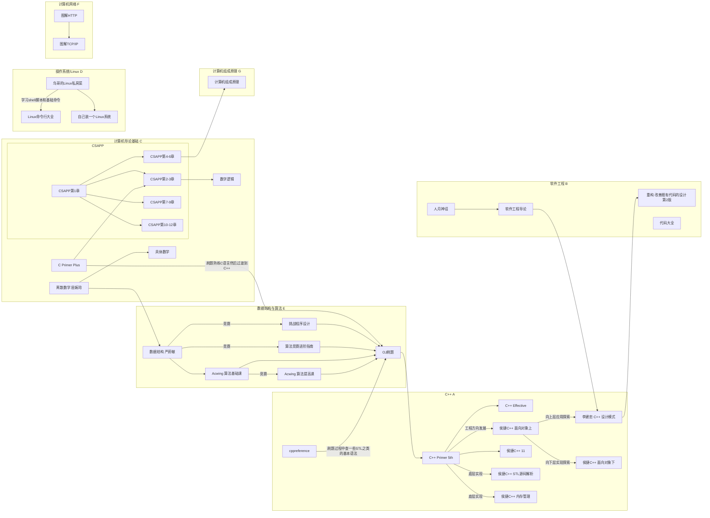

#  书籍课程

## 书籍网课分类关联

* 主要对我大学四年看过的书或者网课做一个总结。因为我自己学的过程中没什么人指导，这造成我走了很多弯路，然后很长一段时间我很迷茫。希望这个图能帮各位

* 注意，这里面很多书都是那些很厚的砖头书，箭头的连接不是说你一定要看完、完全理解才能进入到下一步。你只需要知道这本书讲了哪些内容（看目录），然后理解你当前需要的知识点即可。再往后推进的过程中知道到哪里找就可以了
* **我的建议：不用把这个当作路线图一个个学，你就在里面找到你现在在学的东西。如果你觉得遇到困难，那么逆着箭头方向走；如果你还行继续往后面探索，那么顺着箭头方向走**

